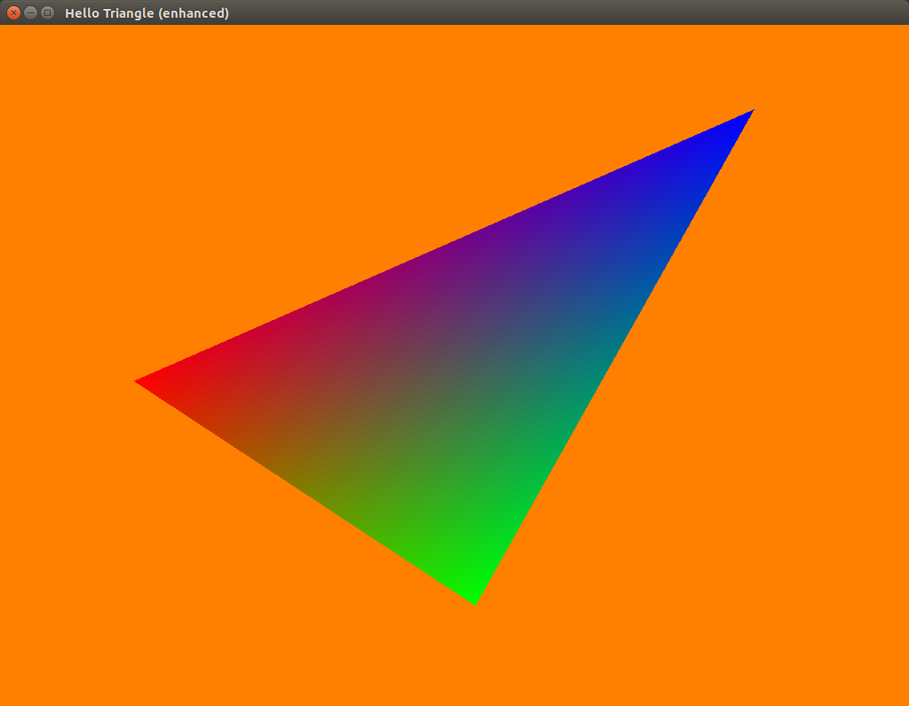
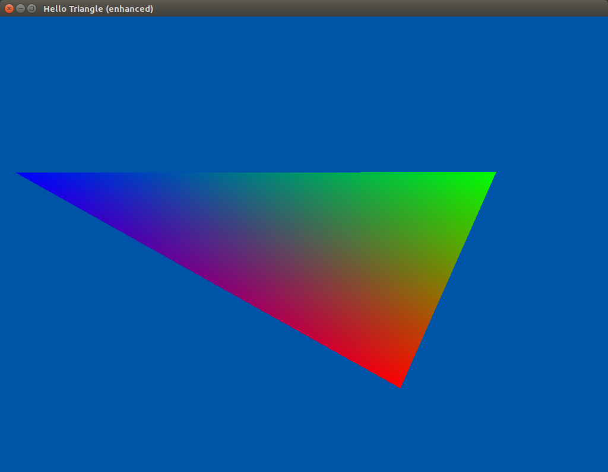
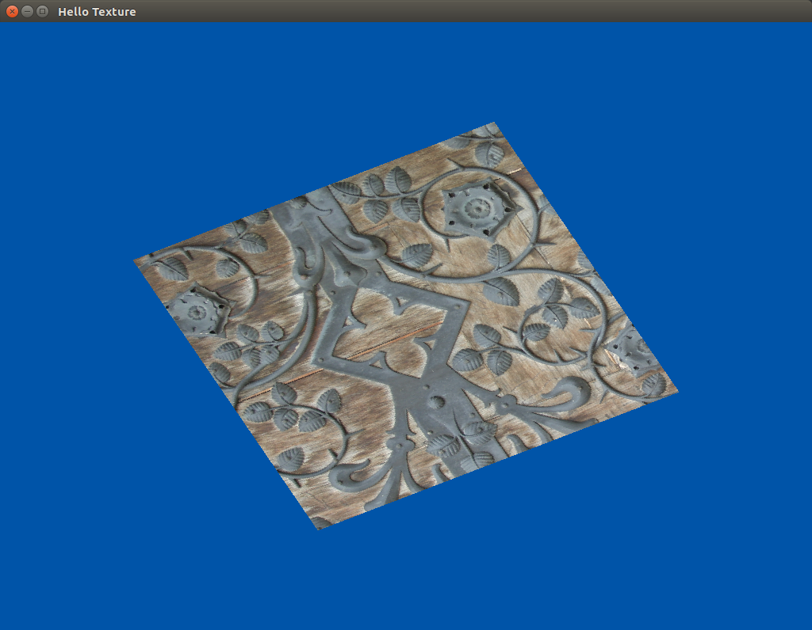

## Content: 

- OpenGL 4:
    - Hello Triangle:  
        - [Simple Java](https://github.com/java-opengl-labs/helloTriangle/blob/master/src/main/java/gl4/HelloTriangleSimple.java) using pure plain JOGL, without additional libraries
        - [Java](https://github.com/java-opengl-labs/helloTriangle/blob/master/src/main/java/gl4/HelloTriangle.java)
        - [Kotlin](https://github.com/java-opengl-labs/helloTriangle/blob/master/src/main/kotlin/gl4/helloTriangle.kt)
    
    - Hello Globe:  
        - [Java](https://github.com/java-opengl-labs/helloTriangle/blob/master/src/main/java/gl4/HelloGlobe.java)
        - [Kotlin](https://github.com/java-opengl-labs/helloTriangle/blob/master/src/main/kotlin/gl4/helloGlobe.kt) 
   
    
    
- OpenGL 3:

    - Hello Triangle: 
        - [Simple Java](https://github.com/java-opengl-labs/helloTriangle/blob/master/src/main/java/gl3/HelloTriangleSimple.java) using pure plain JOGL, without additional libraries
        - [Java](https://github.com/java-opengl-labs/helloTriangle/blob/master/src/main/java/gl3/HelloTriangle.java) 
        - [Kotlin](https://github.com/java-opengl-labs/helloTriangle/blob/master/src/main/kotlin/gl3/helloTriangle.kt) 

    - Hello Texture:  
        - [Java](https://github.com/java-opengl-labs/helloTriangle/blob/master/src/main/java/gl3/HelloTexture.java) 
        - [Kotlin](https://github.com/java-opengl-labs/helloTriangle/blob/master/src/main/kotlin/gl3/helloTexture.kt) 
        
    - GL injection: shows how to inject GL commands into a GL fifo from another thread (like the input listener):
        - [Java](https://github.com/java-opengl-labs/hello-triangle/blob/master/src/main/java/gl3/GL_injection.java)
        - [Kotlin](https://github.com/java-opengl-labs/hello-triangle/blob/master/src/main/kotlin/gl3/gl_injection.kt)
        
    - Input into rendering: shows how to use a fifo stack to pipe events from the EDT (listener) into the rendering loop:
        - [Java](https://github.com/java-opengl-labs/hello-triangle/blob/master/src/main/java/gl3/Input_into_rendering.java)
        - [Kotlin](https://github.com/java-opengl-labs/hello-triangle/blob/master/src/main/kotlin/gl3/input_into_rendering.kt)

## Quick start:

* clone & sync Gradle
* run it and enjoy the OpenGL acceleration on Java :sunglasses: (or even better, on Kotlin :scream:)

If you don't know how to do, follow this simple [tutorial](https://github.com/java-opengl-labs/hello-triangle/wiki/How-to-clone-the-project-and-get-it-running)

If you have any problem/question/doubt do not hesitate asking on the [jogl forums](http://forum.jogamp.org/) or [StackOverflow](http://stackoverflow.com/) or open an [issue here](https://github.com/elect86/helloTriangle/issues)

In case you find the above samples too complex or difficult to understand, I strongly suggest you to start from scratch with a jogl tutorial, such as [modern-jogl-examples](https://github.com/java-opengl-labs/modern-jogl-examples). The original C tutorial it's ported from, it's one of the best, if not the best, out there.
